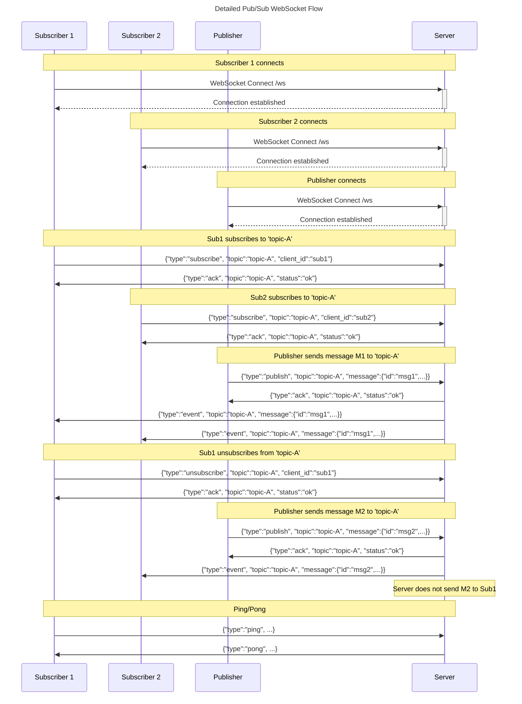

# In-Memory Pub/Sub System

This is a simplified in-memory Publish/Subscribe system implemented in Python using FastAPI. It supports WebSocket communication for pub/sub operations and HTTP REST APIs for management.

## Features

*   **WebSocket Endpoint (`/ws`):**
    *   `subscribe`: Subscribe to a topic.
    *   `unsubscribe`: Unsubscribe from a topic.
    *   `publish`: Publish a message to a topic.
    *   `ping`: Client health check.
*   **HTTP REST Endpoints:**
    *   `POST /topics`: Create a new topic.
    *   `DELETE /topics/{name}`: Delete a topic and disconnect subscribers.
    *   `GET /topics`: List all topics and their subscriber counts.
    *   `GET /health`: System health and basic stats.
    *   `GET /stats`: Detailed stats per topic (message counts, subscribers).
*   **In-Memory:** All state (topics, subscriptions, messages) is held in memory and not persisted across restarts.
*   **Concurrency Safe:** Designed to handle multiple publishers and subscribers concurrently using `asyncio` and locks.
*   **Message Fan-out:** Messages published to a topic are delivered to all current subscribers of that topic.
*   **Topic Isolation:** Messages are isolated to their respective topics.
*   **Message Replay:** Supports replaying the last `n` messages to new subscribers via the `last_n` parameter in the subscribe message. Up to 100 messages are stored per topic.
*   **Heartbeats:** Server sends periodic "ping" info messages to connected WebSocket clients.

## High-Level Design

The system is built around a FastAPI application that manages state in memory using Python's `asyncio` capabilities for concurrency.

*   **API Layer**: FastAPI handles incoming HTTP requests for REST endpoints and manages WebSocket connections via the `/ws` endpoint.
*   **State Management**:
    *   A global `dict` protected by an `asyncio.Lock` stores all `Topic` instances.
    *   Each `Topic` object is responsible for its own set of subscribers, its message history (`deque`), and message fan-out logic.
*   **Concurrency**: `asyncio.Lock` is used within each `Topic` and around the global topic dictionary to prevent race conditions when multiple clients publish or subscribe concurrently.
*   **Fan-Out and Backpressure**: When a message is published to a topic, it is added to an `asyncio.Queue` for each subscriber. A separate asynchronous task per subscriber reads from this queue and sends messages over the WebSocket. If a subscriber's queue reaches its maximum size (`MAX_SUBSCRIBER_QUEUE`), the oldest message is dropped to prevent memory issues and a `SLOW_CONSUMER` error is issued.
*   **Message Replay**: Each topic maintains a fixed-size `deque` (`MAX_HISTORY`) of recent messages, allowing new subscribers to request the `last_n` messages upon subscription.

## Assumptions & Design Choices

*   **Backpressure Policy:** Each subscriber has a bounded queue of 50 messages. If the queue is full when a new message arrives:
    *   The **oldest** message in the queue is dropped.
    *   A `SLOW_CONSUMER` error message is sent to the subscriber (best-effort).
    *   This prevents a slow consumer from consuming excessive memory or blocking the publisher.
*   **Message History:** Each topic stores a maximum of 100 recent messages in a ring buffer for the `last_n` replay feature.
*   **UUIDs for Messages:** Published messages are expected to have a valid UUID in the `message.id` field.
*   **No Authentication:** The system does not implement any authentication for REST or WebSocket endpoints.
*   **Graceful Shutdown:** On shutdown, the server attempts to notify subscribers of topic deletions and close WebSocket connections.

## Prerequisites

*   **Docker:** For running the application in a container.
*   **Python 3.11+:** For running the application locally or running tests.
*   **Node.js & npm:** Optional, for installing `wscat` to easily test WebSockets manually.

## Running the Application

### Option 1: Using Docker (Recommended)

1.  **Build the Docker Image:**
    ```bash
    docker build -t inmemory-pubsub .
    ```

2.  **Run the Docker Container:**
    ```bash
    docker run -d -p 8000:8000 --name pubsub-app inmemory-pubsub
    ```
    The application will be accessible at `http://localhost:8000`.

### Option 2: Running Locally with Python

1.  **Create and activate a virtual environment:**
    ```bash
    python3 -m venv venv
    source venv/bin/activate  # On Windows, use: venv\Scripts\activate
    ```

2.  **Install dependencies:**
    ```bash
    pip install -r requirements.txt
    ```

3.  **Run the server with Uvicorn:**
    ```bash
    uvicorn main:app --host 0.0.0.0 --port 8000 --reload
    ```
    The application will be accessible at `http://localhost:8000`. The `--reload` flag enables hot-reloading for development.

## How to Test

### 1. Automated Tests

The service includes unit and integration tests written with `pytest`. To run them:

1.  Ensure dependencies are installed (`pip install -r requirements.txt`).
2.  Run pytest:
    ```bash
    pytest
    ```

### 2. Manual End-to-End Test

You can test the system manually using `curl` for REST endpoints and `wscat` for WebSockets.

1.  **Install `wscat` (if you don't have it):**
    ```bash
    npm install -g wscat
    ```

2.  **Start the application** using either Docker or Python as described above.

3.  **Create a topic via REST:**
    ```bash
    curl -X POST http://localhost:8000/topics -H "Content-Type: application/json" -d '{"name": "sensor-data"}'
    ```

4.  **In Terminal 1, connect a subscriber:**
    ```bash
    wscat -c ws://localhost:8000/ws
    ```
    Once connected (`>` prompt appears), paste the following message and press Enter:
    ```json
    {"type": "subscribe", "topic": "sensor-data", "client_id": "client-001", "request_id":"sub1"}
    ```
    You should receive an `ack` message.

5.  **In Terminal 2, connect and publish a message:**
    ```bash
    wscat -c ws://localhost:8000/ws
    ```
    Once connected, paste the following message and press Enter:
    ```json
    {"type": "publish", "topic": "sensor-data", "message": {"id": "550e8400-e29b-41d4-a716-446655440000", "payload": {"temp": 22.5}}, "request_id":"pub1"}
    ```

6.  **Verify:** You should receive an `ack` in Terminal 2, and an `event` message containing `{"temp": 22.5}` should appear in Terminal 1.

## API Usage

### REST Endpoints

*   **Create Topic:**
    ```bash
    curl -X POST http://localhost:8000/topics -H "Content-Type: application/json" -d '{"name": "orders"}'
    ```

*   **List Topics:**
    ```bash
    curl http://localhost:8000/topics
    ```

*   **Delete Topic:**
    ```bash
    curl -X DELETE http://localhost:8000/topics/orders
    ```

*   **Health Check:**
    ```bash
    curl http://localhost:8000/health
    ```

*   **Stats:**
    ```bash
    curl http://localhost:8000/stats
    ```

### WebSocket Endpoint (`ws://localhost:8000/ws`)

Use a WebSocket client (e.g., JavaScript in a browser, `wscat`, Python `websocket-client`) to interact. Messages are JSON.

#### Client -> Server Messages

*   **Subscribe:**
    ```json
    {
      "type": "subscribe",
      "topic": "orders",
      "client_id": "s1",
      "last_n": 5,
      "request_id": "sub-123"
    }
    ```

*   **Unsubscribe:**
    ```json
    {
      "type": "unsubscribe",
      "topic": "orders",
      "client_id": "s1",
      "request_id": "unsub-456"
    }
    ```

*   **Publish:**
    ```json
    {
      "type": "publish",
      "topic": "orders",
      "message": {
        "id": "a1b2c3d4-e5f6-7890-1234-567890abcdef",
        "payload": {
          "order_id": "ORD-789",
          "amount": "12.34",
          "currency": "USD"
        }
      },
      "request_id": "pub-789"
    }
    ```

*   **Ping:**
    ```json
    {
      "type": "ping",
      "request_id": "ping-abc"
    }
    ```

#### Server -> Client Messages

*   **Ack:** Confirms `subscribe`, `unsubscribe`, or `publish`.
    ```json
    {
      "type": "ack",
      "request_id": "sub-123",
      "topic": "orders",
      "status": "ok",
      "ts": "2025-08-25T10:00:00Z"
    }
    ```

*   **Event:** A message delivered to a subscriber.
    ```json
    {
      "type": "event",
      "topic": "orders",
      "message": {
        "id": "a1b2c3d4-e5f6-7890-1234-567890abcdef",
        "payload": {
          "order_id": "ORD-789",
          "amount": "12.34",
          "currency": "USD"
        }
      },
      "ts": "2025-08-25T10:01:00Z"
    }
    ```

*   **Error:** Reports an issue with a request or connection.
    ```json
    {
      "type": "error",
      "request_id": "req-xyz",
      "topic": "invalid-topic",
      "error": {
        "code": "TOPIC_NOT_FOUND",
        "message": "Topic 'invalid-topic' not found"
      },
      "ts": "2025-08-25T10:02:00Z"
    }
    ```

*   **Pong:** Response to a client `ping`.
    ```json
    {
      "type": "pong",
      "request_id": "ping-abc",
      "ts": "2025-08-25T10:03:00Z"
    }
    ```

*   **Info:** Server-initiated message (e.g., heartbeat or topic deletion).
    ```json
    {
      "type": "info",
      "msg": "ping",
      "ts": "2025-08-25T10:04:00Z"
    }
    ```
    ```json
    {
      "type": "info",
      "topic": "orders",
      "msg": "topic_deleted",
      "ts": "2025-08-25T10:05:00Z"
    }
    ```

## Sequence Diagram

The following diagram illustrates a more detailed WebSocket flow including subscribe, publish, fan-out, unsubscribe, and ping/pong:


